# Solución Completa de la Prueba - Skate Park

Repositorio con el código solución de la prueba con la que se finaliza el módulo 8 **Implementación de API backend Node Express** de la beca dada por Talento Digital para Chile **Desarrollo de aplicaciones Full Stack Javascript Trainee** y dictada por Desafío Latam.

## Tabla de Contenido

- [Solución Completa de la Prueba - Skate Park](#solución-completa-de-la-prueba---skate-park)
  - [Tabla de Contenido](#tabla-de-contenido)
  - [Deploy](#deploy)
  - [Requisitos](#requisitos)
  - [Diagrama de Flujo](#diagrama-de-flujo)
    - [1.Página Home](#1página-home)
    - [2.Página Registro](#2página-registro)
      - [2.1.Registro de Participante Exitoso](#21registro-de-participante-exitoso)
      - [2.2.Verificación de Registro exitoso de Participante Exitoso Front End](#22verificación-de-registro-exitoso-de-participante-exitoso-front-end)
      - [2.3.Verificación de Registro exitoso de Participante Exitoso Back End](#23verificación-de-registro-exitoso-de-participante-exitoso-back-end)
    - [3.Página LogIn de Participante](#3página-login-de-participante)
      - [3.1.LogIn exitoso de Participante](#31login-exitoso-de-participante)
      - [3.2.Página Cuenta de Usuario](#32página-cuenta-de-usuario)
      - [3.3.Token Expirado después de 2 minutos](#33token-expirado-después-de-2-minutos)
      - [3.4.Alerta Edición exitosa](#34alerta-edición-exitosa)
      - [3.5.Verificación edición exitosa front end](#35verificación-edición-exitosa-front-end)
      - [3.6.Verificación edición exitosa back end](#36verificación-edición-exitosa-back-end)
    - [4.Página Admin](#4página-admin)
      - [4.1.Alerta Cambio de estado exitoso de participante por Admin](#41alerta-cambio-de-estado-exitoso-de-participante-por-admin)
      - [4.2.Verificación Cambio de estado exitoso de participante por Admin Front End](#42verificación-cambio-de-estado-exitoso-de-participante-por-admin-front-end)
      - [4.3.Verificación Cambio de estado exitoso de participante por Admin Back End](#43verificación-cambio-de-estado-exitoso-de-participante-por-admin-back-end)
    - [5.Alerta de Eliminación de Participante exitosa](#5alerta-de-eliminación-de-participante-exitosa)
      - [5.1. Verificación de Eliminación de participante Front End](#51-verificación-de-eliminación-de-participante-front-end)
      - [5.2. Verificación de Eliminación de participante Back End](#52-verificación-de-eliminación-de-participante-back-end)
  - [Soluciones](#soluciones)
    - [1. Crear una API REST con el Framework Express (3 Puntos)](#1-crear-una-api-rest-con-el-framework-express-3-puntos)
    - [2. Servir contenido dinámico con express-handlebars (3 Puntos)](#2-servir-contenido-dinámico-con-express-handlebars-3-puntos)
    - [3. Ofrecer la funcionalidad Upload File con express-fileupload (2 Puntos)](#3-ofrecer-la-funcionalidad-upload-file-con-express-fileupload-2-puntos)
    - [4. Implementar seguridad y restricción de recursos o contenido con JWT (2 Puntos)](#4-implementar-seguridad-y-restricción-de-recursos-o-contenido-con-jwt-2-puntos)

## Deploy

El proyecto es 100% funcional y esta operativo en la web. Lo he desplegado en Render en el siguiente [link](https://skate-park-app.onrender.com/)

## Requisitos

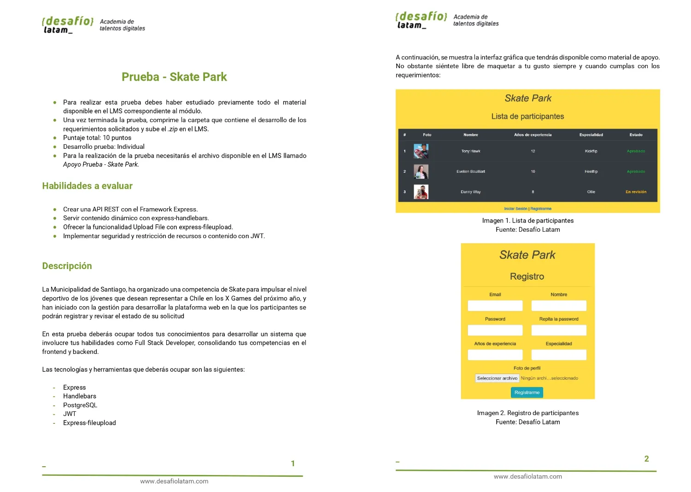
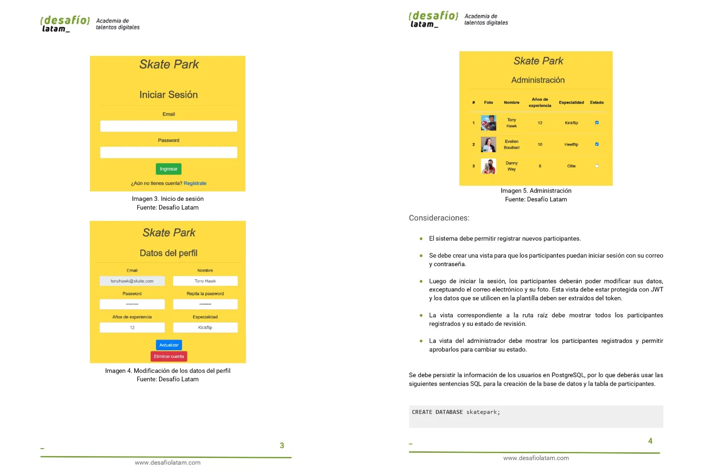
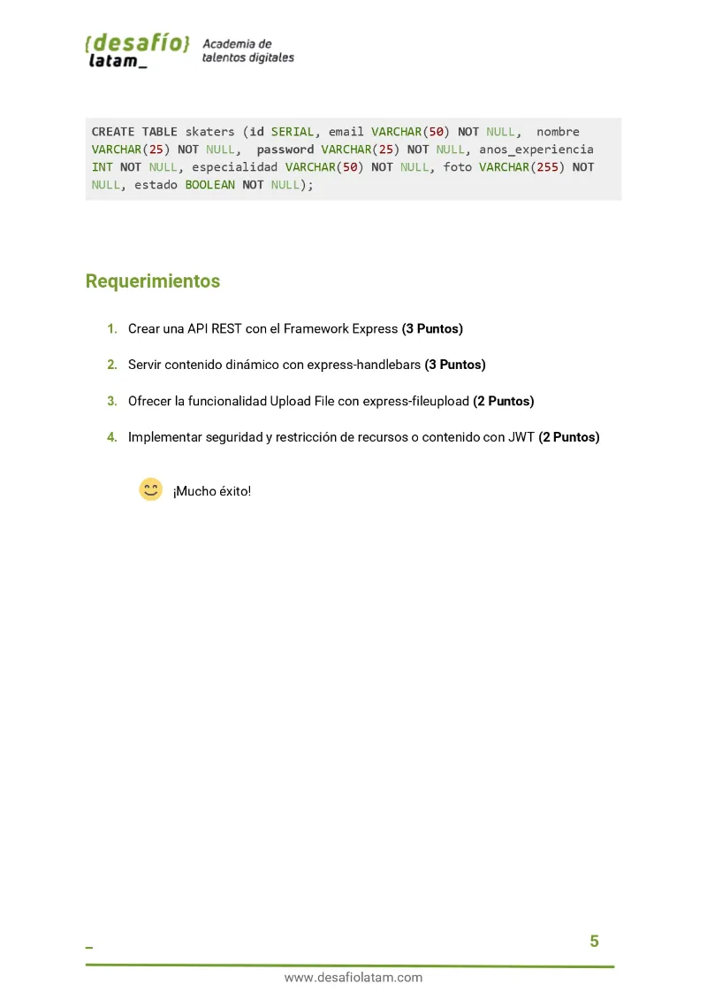

## Diagrama de Flujo

### 1.Página Home

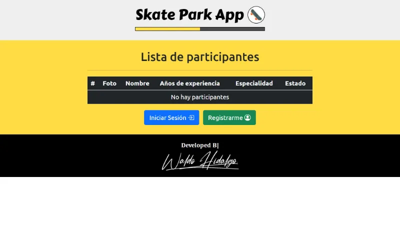

### 2.Página Registro

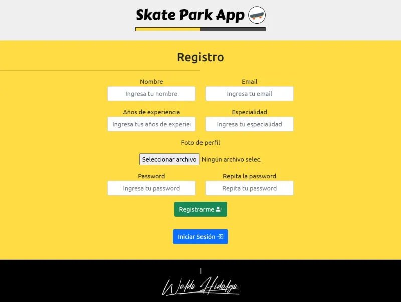

#### 2.1.Registro de Participante Exitoso

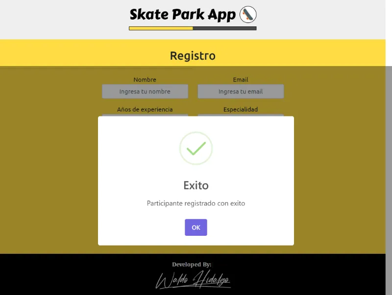

#### 2.2.Verificación de Registro exitoso de Participante Exitoso Front End


#### 2.3.Verificación de Registro exitoso de Participante Exitoso Back End

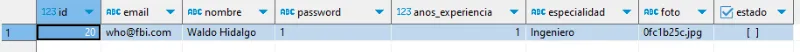

### 3.Página LogIn de Participante

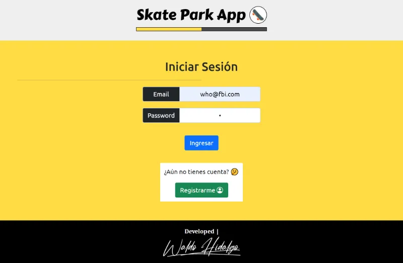

#### 3.1.LogIn exitoso de Participante

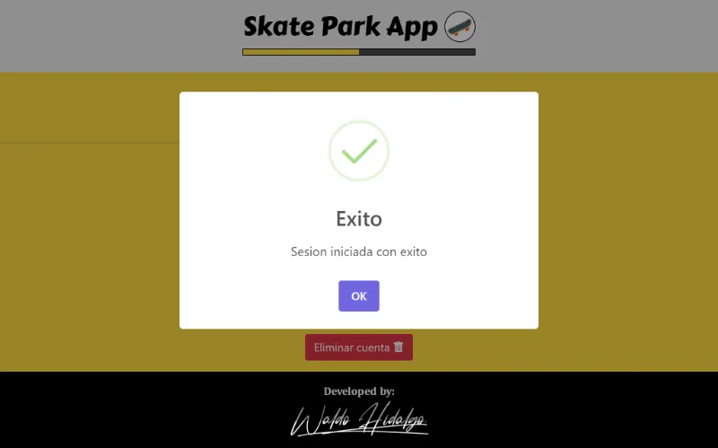

#### 3.2.Página Cuenta de Usuario

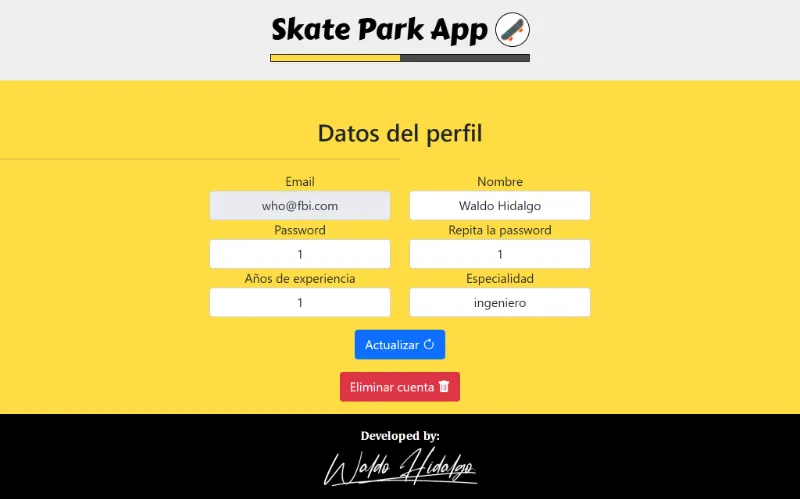

#### 3.3.Token Expirado después de 2 minutos

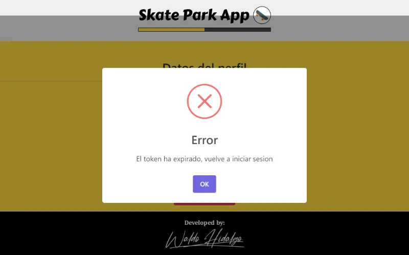

#### 3.4.Alerta Edición exitosa

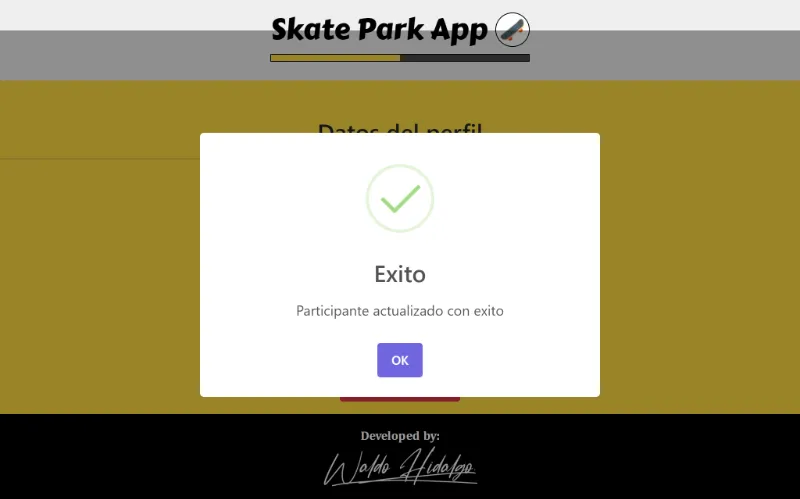

#### 3.5.Verificación edición exitosa front end

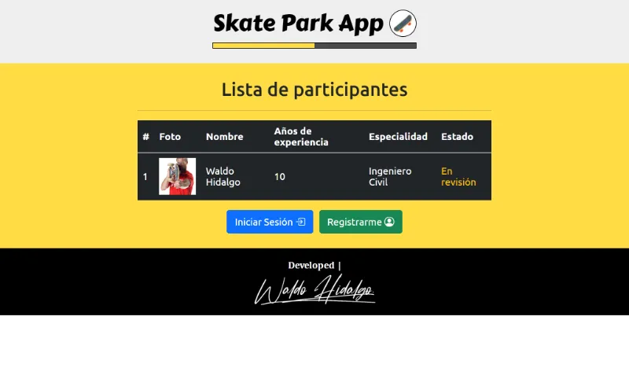

#### 3.6.Verificación edición exitosa back end

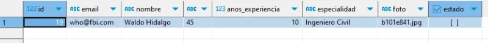

### 4.Página Admin


#### 4.1.Alerta Cambio de estado exitoso de participante por Admin

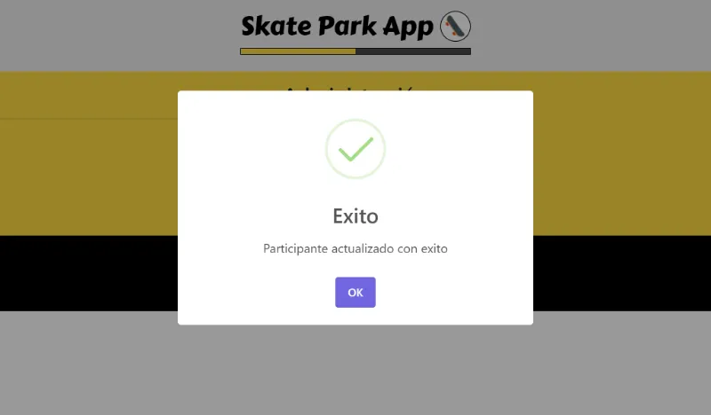

#### 4.2.Verificación Cambio de estado exitoso de participante por Admin Front End

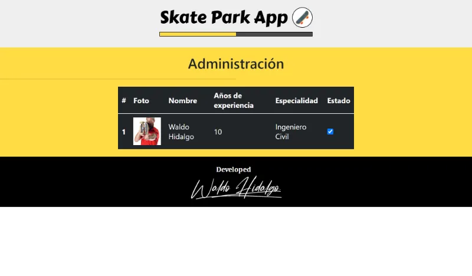

#### 4.3.Verificación Cambio de estado exitoso de participante por Admin Back End

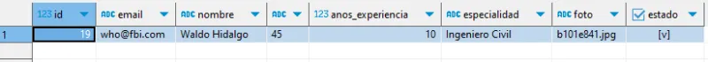

### 5.Alerta de Eliminación de Participante exitosa

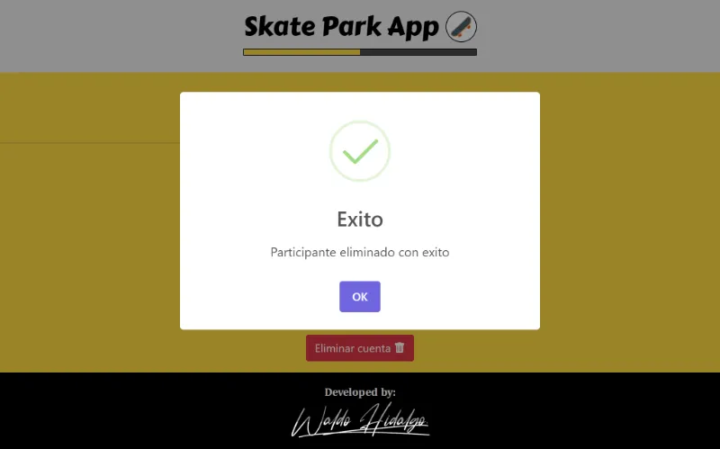

#### 5.1. Verificación de Eliminación de participante Front End

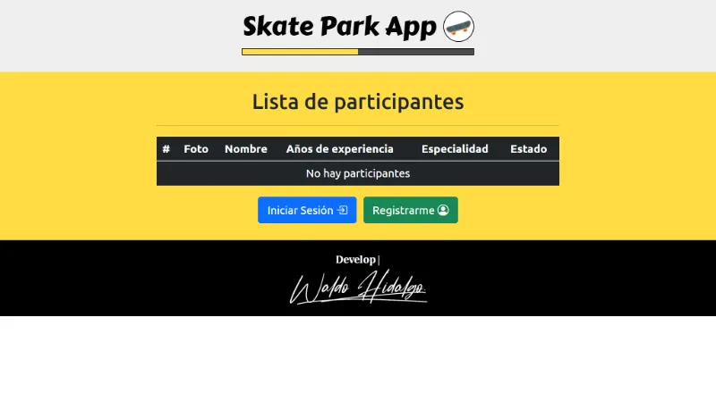

#### 5.2. Verificación de Eliminación de participante Back End


## Soluciones

### 1. Crear una API REST con el Framework Express (3 Puntos)

Para manipular la creación, edición, lectura y eliminación de participantes he creado la siguiente API REST:

```js
router.get("/participantes", getParticipantes);
router.post("/participante", postParticipante);
router.delete("/participante", deleteParticipante);
router.put("/participante", putEditParticipante);
router.patch("/participante", patchEditParticipante);
```

### 2. Servir contenido dinámico con express-handlebars (3 Puntos)

He servido contenido dinámico con express-handlebars por ejemplo la página de Admin para la cual he utilizado el siguiente código:

```hbs
{{> header}}
<main class="py-3 main_page_admin">
  <h2>Administración</h2>
  <hr class="w-50" />
  <div class="table-responsive">
    <table class="table w-50 m-auto table-dark">
      <thead>
        <tr>
          <th scope="col">#</th>
          <th scope="col">Foto</th>
          <th scope="col">Nombre</th>
          <th scope="col">Años de experiencia</th>
          <th scope="col">Especialidad</th>
          <th scope="col">Estado</th>
        </tr>
      </thead>
      <tbody>
        {{#if ( arrayVacio participantes) }}
        <tr>
          <td colspan="6">No hay participantes</td>
        </tr>
        {{else}}
        {{#each participantes}}
        <tr>
          <th scope="row">{{addOne @index}}</th>
          <td>
            <div class="participante_foto">
              
            </div>
          </td>
          <td>{{ this.nombre }}</td>
          <td>{{ this.anos_experiencia }}</td>
          <td>{{ this.especialidad }}</td>
          <td>
            {{#if this.estado }}
            <input
              data-email="{{ this.email }}"
              class="aprobado_checkbox"
              type="checkbox"
              checked
            />
            {{else}}
            <input
              data-email="{{ this.email }}"
              class="aprobado_checkbox"
              type="checkbox"
            />
            {{/if}}
          </td>
        </tr>
        {{/each}}
        {{/if}}
      </tbody>
    </table>
  </div>
</main>
{{> footer}}

<script type="module" src="/public/js/pages/admin.js"></script>

```

### 3. Ofrecer la funcionalidad Upload File con express-fileupload (2 Puntos)

Implemento la librería express-fileupload al cargar un archivo en la creación de un participante:

```js
const maxSize = 1 * 1024 * 1024;
export default async function postParticipante(req, res) {
  try {
    const {
      email,
      nombre,
      anos_experiencia,
      especialidad,
      password,
      password2,
    } = req.body;
    const participantes = await getAllDataParticipantesQuery();
    if (participantes.find((participante) => participante.email === email)) {
      res.status(400).send("El email ya existe");
      return;
    }
    const {
      foto: { size, mimetype, mv: moveFile },
    } = req.files;
    if (password !== password2) {
      res.status(400).send("Las contraseñas no coinciden");
      return;
    }
    if (size > maxSize) {
      res.status(413).send("El tamaño del archivo es demasiado grande");
      return;
    }
    if (
      mimetype !== "image/jpeg" &&
      mimetype !== "image/png" &&
      mimetype !== "image/jpg" &&
      mimetype !== "image/gif" &&
      mimetype !== "image/webp"
    ) {
      res.status(415).send("El formato del archivo no es válido");
      return;
    }
    const nombreFoto = `${uuidv4().slice(0, 8)}.jpg`;
    moveFile(path.resolve("public", "imagenes", nombreFoto), async (err) => {
      if (err) {
        res.status(500).send(err);
        return;
      }
      try {
        const data = await postParticipantesQuery({
          email,
          nombre,
          password,
          anos_experiencia,
          especialidad,
          foto: nombreFoto,
          estado: false,
        });
        console.log(data);
        res.status(200).send("exito");
      } catch (error) {
        res.status(500).send(error);
      }
    });
  } catch (error) {
    console.log(error);
    res.status(500).send(error);
  }
}
```

### 4. Implementar seguridad y restricción de recursos o contenido con JWT (2 Puntos)

Implemento creación de token en el login de usuario tal y como muestro a continuación:

```js
export default async function loginUser(req, res) {
  try {
    const { email, password } = req.body;
    if (!email || !password) {
      res.status(400).send("Faltan datos");
      return;
    }
    const participantes = await getAllDataParticipantesQuery();
    const participante = participantes.find(
      (participante) => participante.email === email
    );
    if (!participante) {
      res.status(400).send("El email no existe");
      return;
    }
    if (participante.password !== password) {
      res.status(400).send("La contraseña es incorrecta");
      return;
    }

    jwt.sign(participante, secretKey, { expiresIn: 2 * 60 }, (err, token) => {
      if (err) {
        res.status(500).send("Ha ocurrido un error");
        return;
      }
      res.status(200).json({ token });
    });
  } catch (error) {
    console.log(error);
    res.status(500).send(error);
  }
}
```

Implemento verificación de token al editar o eliminar data del participante. En este caso muestro la verificación de token al eliminar a participante:

```js
export default async function deleteParticipante(req, res) {
  try {
    const token = req.headers.authorization.split(" ")[1];
    jwt.verify(token, process.env.SECRET_KEY_JWT, async (err, decoded) => {
      if (err) {
        if (err.message === "jwt expired") {
          res.status(401).send("El token ha expirado");
          return;
        }
        res.status(401).send("Token inválido");
        return;
      }
      const email = decoded.email;
      const data = await deleteParticipanteQuery(email);
      console.log(!data);
      if (!data) {
        res.status(404).send("Participante no encontrado");
        return;
      }
      console.log(path.resolve("public", "imagenes", data.foto));
      fs.unlink(path.resolve("public", "imagenes", data.foto), (err) => {
        if (err) {
          console.log(err);
          res.status(500).send("Error al borrar la imagen");
          return;
        }
        res.status(200).send("Participante eliminado");
      });
    });
  } catch (error) {
    console.log(error.message);
    res.status(500).send(error);
  }
}
```
